**Hướng dẫn sử dụng Dropbox**

Để sử dụng được **Dropbox** thì trước tiên cần phải có một tài khoản.
hãy làm theo các bước hướng dẫn dưới đây để đăng kí miễn phí tài khoản
trên **Dropbox**:

1.  hãy click vào <https://www.dropbox.com/register> để mở trang đăng kí

2.  Điền đầy đủ thông tin của vào khung đăng kí theo hướng dẫn dưới đây:

 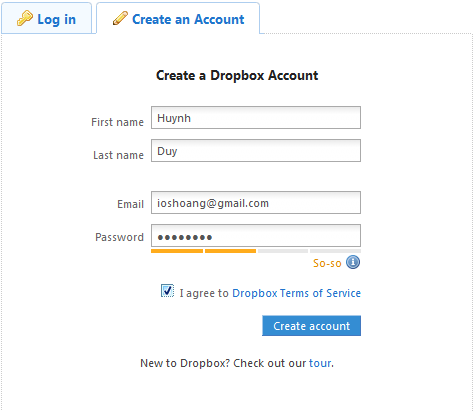

1.  Sau khi điền xong, hãy click vào nút **Create account** để gửi
    đăng kí.

http://afublog.com/2010/05/18/huong-dan-su-dung-dropbox-p1/

-   Sau khi gửi đăng kí thành công, **Dropbox** sẽ chuyển đến *trang tải
    về*. Tại đây, hãy click vào nút **Free Download** để thực hiện quá
    trình tải **Dropbox** về *(nếu sử dụng OS
    [*Linux*](https://www.dropbox.com/downloading?os=lnx) hoặc
    [*Mac*](https://www.dropbox.com/downloading?os=mac) hoặc
    [*iPhone*](https://www.dropbox.com/iphoneapp), hãy lựa chọn đường
    dẫn tải về tương ứng ở phía dưới nút **Free Download**!)*

-   Sau khi tải về xong, hãy mở tập tin mà mình vừa tải về để thực hiện
    quá trình cài đặt **Dropbox** vào PC

 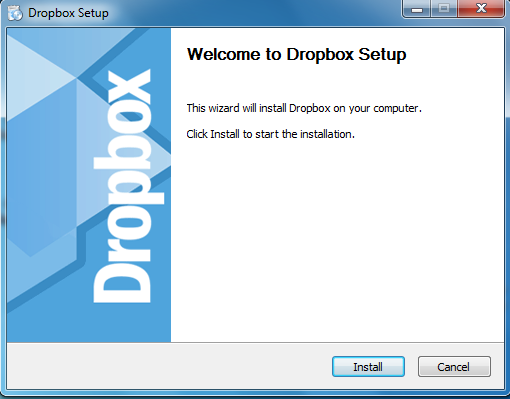

-   Click **Install** để tiếp tục

-   Chọn **Yes, I already have a Dropbox account .** Vì đã đăng ký
    account trước đó

 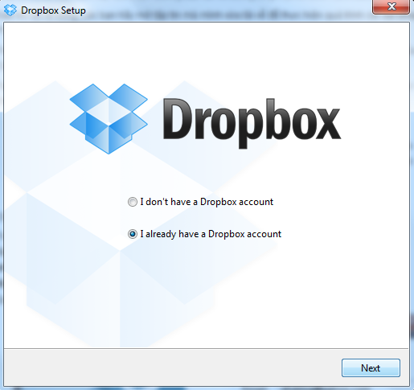

-   Điền các thông tin đăng nhập vào tài khoản **Dropbox** của vào khung
    **Log in to Dropbox**

 ***Lưu ý:*** Tại ô **Computer Name**, hãy điền tên mà muốn đặt cho PC
 của mình – Tên này sẽ được sử dụng cho **Dropbox** chứ không hề liên
 quan/ảnh hưởng tới tên của PC mà đã đặt cho hệ điều hành trước đó!

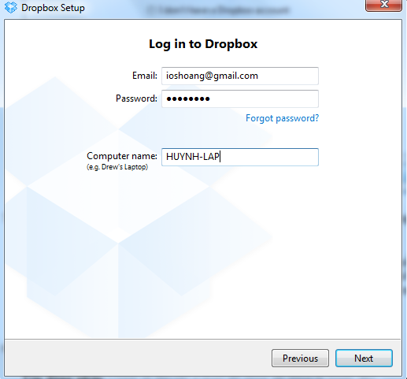

-   Click **Next** để tiếp tục

-   Chọn gói **Free** với dung lượng là 2GB

 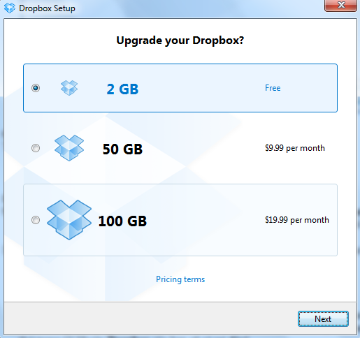
http://afublog.com/2010/05/18/dropbox-sao-luu-tru-du-lieu-truc-tuyen-mien-phi/

-   Click **Next** để tiếp tục.

-   Chọn **Advance** để thiết lập cấu hình

 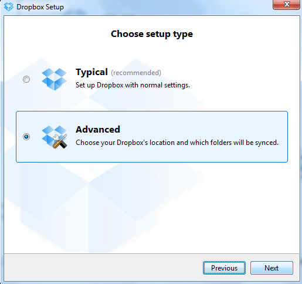

-   Click **Next** để tiếp tục.

-   Chọn **I want to choose where to put my Dropbox folder**. Tiếp theo,
    hãy click vào **Change…** rồi sau đó lựa chọn nơi mà muốn lưu trữ
    thư mục **Dropbox** của mình.Click **Next**

 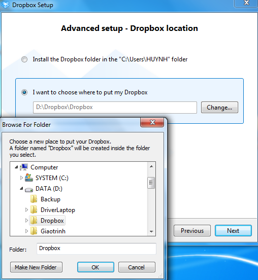

-   Chọn **I want this computer to sync all of the folders in my
    Dropbox** để đồng bộ các thư mục trong Dropbox

    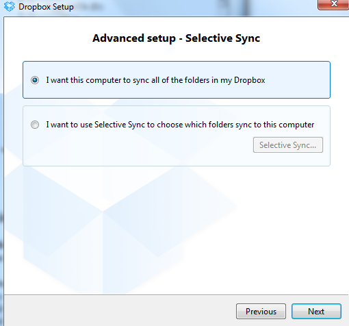

-   Click **NextSkip tourFinish** để hoàn tất quá trình cài đặt.

**Các thủ thuật khi sử dụng Dropbox **

**» Đồng bộ hóa/chia sẻ dữ liệu trong máy tính với các thiết bị khác
(PC, iMac, iPhone…) của bạn:**

Công việc này khá là đơn giản, bước đầu tiên cần phải làm đó chính là
cài đặt **Dropbox** cho cả hai *(hoặc nhiều hơn)* thiết bị mà muốn đồng
bộ hóa/chia sẻ dữ liệu.

**Shared Folder là gì?** Nguồn: All 4 You Blog –
http://afublog.com/2010/05/18/huong-dan-su-dung-dropbox-p1/

Shared Folder là thư mục mà bạn sẽ dùng để đồng bộ hóa hay nói đúng hơn
là dùng để chia sẻ các tập tin có trong đó với các thiết bị khác của
bạn.

**Sẽ có 2 cách để tạo một *Shared Folder*:**

**Cách 1:** Tạo trực tiếp trên máy tính của bạn: *(hoặc các thiết bị
được **Dropbox** hỗ trợ khác)*

1.  hãy mở thư mục **Dropbox** trong máy tính *(hoặc iMac, iPhone…)* của
    mình

2.  Tạo một thư mục mới trong thư mục **Dropbox**,**Right-Click** vào
    thư mục mà mình vừa mới tạo rồi sau đó lựa chọn **Dropbox** -&gt;
    chọn **Share This Folder…**

 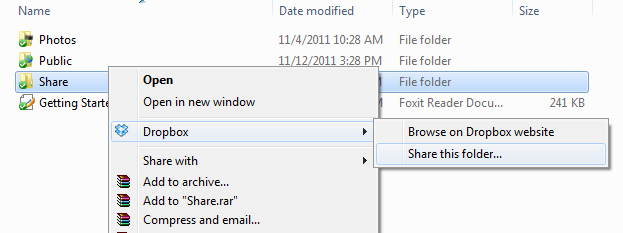

1.  Ngay lập tức, **Dropbox** sẽ chuyển đến trang chia sẻ thư mục
    trên dropbox.com. Tại đây, hãy điền địa chỉ e-mail của một
    *(hoặc nhiều)* tài khoản **Dropbox** khác mà muốn đồng bộ hóa/chia
    sẻ dữ liệu vào ô E**nter recipient email addresses here**. Nếu muốn
    kèm theo lời nhắn nào đó vào trong thư mời, hãy gõ lời nhắn đó vào ô
    **Enter a message**. Sau khi điền xong, hãy click vào nút **Share
    folder** để gửi thư mời.

 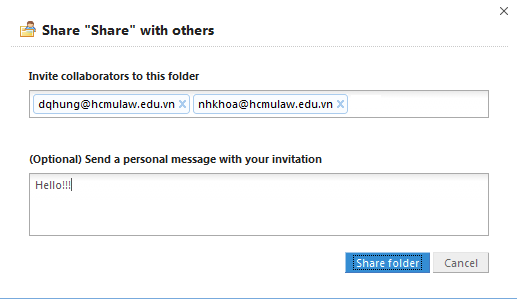

 **Lưu ý:** Đối với trường hợp gửi thư mời tới nhiều hơn 2 tài khoản
 thì cần phải sử dụng dấu phẩy có cách “**,** ” để phân biệt giữa các
 địa chỉ e-mail với nhau.

 //afublog.com/2010/05/18/huong-dan-su-dung-dropbox-p1/

***Nếu là chủ của tài khoản Dropbox được mời:***

1.  hãy đăng nhập vào địa chỉ e-mail được mời và check mail

2.  Sẽ có một e-mail với tiêu đề “**\[Tên đầy đủ của tài khoản Dropbox
    gửi lời mời\] has invited you to a Dropbox shared folder**” được gửi
    đến cho . hãy click vào dòng chữ **View “\[Tên của thư mục được
    mời\]“** có trong thư mời đó để xác nhận yêu cầu lời mời.

3.  Đăng nhập vào tài khoản **Dropbox** được mời *(nếu hệ thống không tự
    động đăng nhập)*

4.  Tại giao diện xác nhận lời mời, hãy click vào nút **Accept** để đồng
    ý đồng bộ hóa/chia sẻ dữ liệu với tài khoản **Dropbox** mời.

***Cách 2:*** Tạo trực tiếp trên website của **Dropbox** Nguồn: All 4
You Blog – http://afublog.com/2010/05/18/huong-dan-su-dung-dropbox-p1/:

***Sẽ có 2 cách:***

***Cách 1:***

1.  Đăng nhập vào tài khoản **Dropbox** của theo đường dẫn sau:
    [*https://www.dropbox.com/login\#login*](https://www.dropbox.com/login#login)

2.  Tại thẻ **Files**, hãy chọn **Create folder** -&gt; Đặt tên cho thư
    mục mà bạn muốn tạo -&gt; Click **Create** để tạo thư mục mới

3.  Sau khi tạo thành công một thư mục mới, hãy tick vào ô vuông ở phía
    trước thư mục vừa tạo rồi sau đó chọn thẻ **Invite this folder** để
    tạo Shared Folder cho thư mục mà bạn vừa tạo

 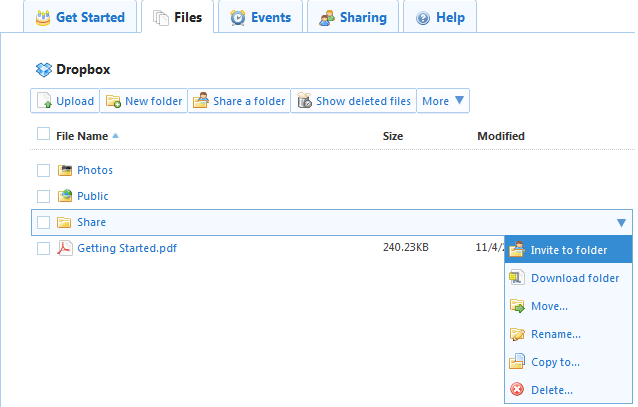

1.  Tiếp theo làm tương tự như **Cách Tạo trực tiếp trên máy tính**.

***Cách 2:*** Nguồn: All 4 You Blog –
http://afublog.com/2010/05/18/dropbox-sao-luu-tru-du-lieu-truc-tuyen-mien-phi/

1.  Đăng nhập vào tài khoản **Dropbox** của theo đường dẫn sau:
    [*https://www.dropbox.com/login\#login*](https://www.dropbox.com/login#login)

2.  Tại thẻ **Files**, hãy click vào **Share a folder**

 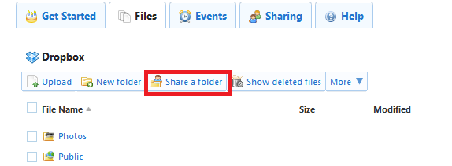

1.  Để tạo mới, hãy tick vào ô **I’d like to creat and share a new
    folder** rồi sau đó điền tên thư mục mà mình muốn tạo vào khung
    **New folder name**
    Sau khi điền xong, hãy click vào **Next** để tiếp tục

 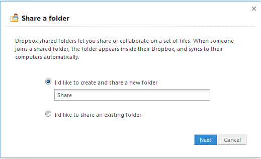

Công việc tiếp theo sẽ tương tự như **Tạo trực tiếp trên máy tính**.

- Để tạo Shared Folder cho 1 thư mục có sẵn trong tài khoản **Dropbox**
của các , hãy tick vào ô **I’d like to share an existing folder** rồi
sau đó click **Next** để tiếp tục
Tại giao diện vừa mở, hãy chọn một thư mục có sẵn để tạo Shared Folder
cho thư mục đó bằng cách: click đơn vào thư mục đấy rồi sau đó click vào
**Next** để tiếp tục

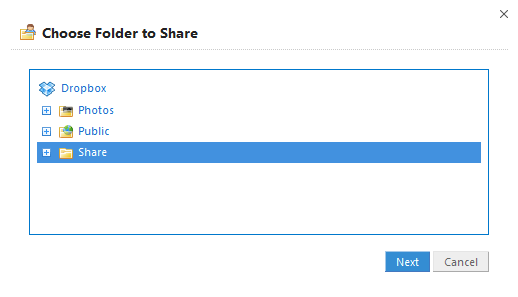

***Lưu ý:*** Quá trình tạo Shared Folder sẽ không bắt buộc là phải tạo
trên một thiết bị nhất định nào đó. Sau khi một Shared Folder đã được
đồng bộ hóa/chia sẻ dữ liệu, ngay lập tức các thiết bị được mời sử dụng
Shared Folder này sẽ tự động tạo một thư mục Share Folder giống y nguyên
thư mục Shared Folder gốc *(kể cả các dữ liệu bên trong*) vào trong thư
mục My Dropbox của họ! Do đó các thư mục Shared Folder sẽ hoàn toàn
giống nhau trong các thiết bị mời và được mời. Tuy nhiên, sẽ có một số
ưu thế cho tài khoản **Dropbox** mời – tài khoản mà đã tạo ra Shared
Folder

**Một số thông tin liên quan tới Shared Folder:**
- Bạn không thể tạo Shared Folder trong thư mục Public được
- Bạn không thể tạo Shared Folder con trong một thư mục Shared Folder mẹ
được
- Những người được mời sử dụng Shared Folder sẽ có toàn quyền quyết định
tới Shared Folder đó bao gồm: xóa, thêm, đổi tên… các tập tin hoặc thư
mục có trong Shared Folder đó
- Những người được mời sử dụng Shared Folder sẽ có toàn quyền được mời
người khác cùng sử dụng Shared Folder đó
- Chỉ có tài khoản tạo ra Shared Folder mới có quyền trục xuất các tài
khoản **Dropbox** đã được mời
- Nếu có 2 tài khoản cùng một lúc thay đổi các thông tin của tập tin
hoặc thư mục trong Shared Folder, **Dropbox** sẽ lưu lại cả 2 sự thay
đổi đó với 2 tập tin hoặc thực mục riêng biệt.

**Cách nghe nhạc từ Dropbox**

Bước 1. Trước tiên hãy tạo mới 1 thư mục để chứa các tập âm thanh (.mp3,
…) rồi sau đó sao chép những bài hát vào thư mục này.

**Lưu ý:** có thể sử dụng thư mục mới tạo này như là một
“Dropbox-Shared-Folder” để đồng bộ hóa/chia sẻ những bài hát.

Bước 2. Truy cập vào droptun.es với tài khoản Dropbox của bạn.

**DropTunes** là dịch vụ sẽ truy cập và phát những tập tin âm thanh có
trong Dropbox.
DropTunes hoạt động bằng cách tạo ra một thư mục DropTunes theo đường
dẫn /Public/DropTunes trong tài khoản Dropbox của bạn để lưu các tập tin
cấu hình.

Bước 3. Tại giao diện người dùng của droptun.es, chọn thư mục mà mình
vừa mới tạo ở bước 1 để mở danh sách các bài hát.

Bước 4. Nhấp chuột vào “Play” để nghe bài hát có trong danh sách.

có thể điều chỉnh âm lượng ở phía trên, góc phải giao diện người dùng
của Droptunes.

**Một số tính năng của Droptunes:**

-   Hỗ trợ nghe OGG và WAV ở chế độ HTML5

-   Tự động chuyển bài khi kết thúc một bài hát

