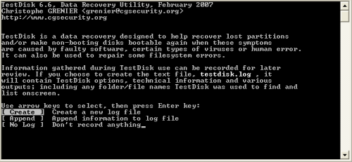
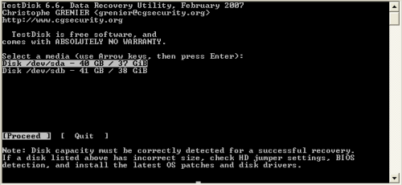
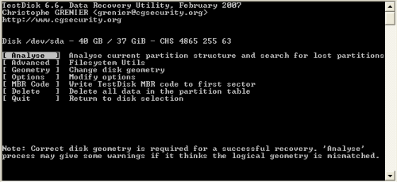
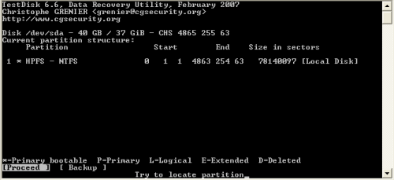
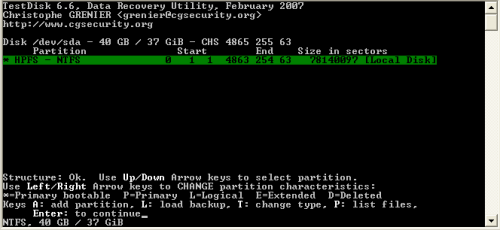
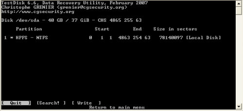

TestDisk 6,6 sẽ cho phép sao lưu dữ liệu của bạn, và nếu bạn để cho nó
viết lại cấu trúc phân vùng, nó sẽ chuyển đổi đĩa dynamic thành basic mà
không cần động vào dữ liệu.

Chạy **TestDisk**:

Chọn **Create** để ghi lại thông tin.

Chương trình sẽ nhận ra tất cả các ổ đĩa kết nối với máy tính của bạn (ổ
cứng gắn trong, gắn ngoài, ổ đĩa flash).

Chọn một trong những ổ mà bạn muốn làm việc, chọn **Proceed** và nhấn
**Enter**.

Chọn tùy chọn thích hợp và ấn **Enter**.

 

Chọn **Analyse** và ấn **Enter**.

Nó sẽ hiển thị cấu trúc hiện tại. Chọn **Backup** trước tiên, sau đó
chọn **Proceed**. Tốt nhất là nên sao lưu nếu bạn sau này muốn khôi phục
lại cấu trúc phân vùng của ổ đĩa.

 

Có thể sẽ mất một lúc mới đến màn hình trên nếu ổ đĩa của bạn có vấn đề,
nhưng cuối cùng, nó cũng sẽ hiển thị tất cả các phân vùng nó được tìm
thấy. Chọn một phân vùng và ấn *phím P* nếu bạn muốn xem các tập tin
được lưu trữ trên phân vùng đó, sau đó ấn *phím C* để sao chép các tập
tin vào các ổ đĩa nào có đủ chỗ trống.

Ấn **Enter** để tiếp tục.

 

Và giờ là lúc chuyển đổi đĩa cứng của bạn từ *dạng dynamic thành basic*.
Chọn **Write**, sau đó ấn *phím Y* để xác nhận rằng bạn muốn viết cấu
trúc phân vùng mới vào đĩa.

Thoát chương trình, khởi động lại ổ đĩa mà bạn chỉ vừa sửa đổi và tận
hưởng ổ mới với định dạng basic.
